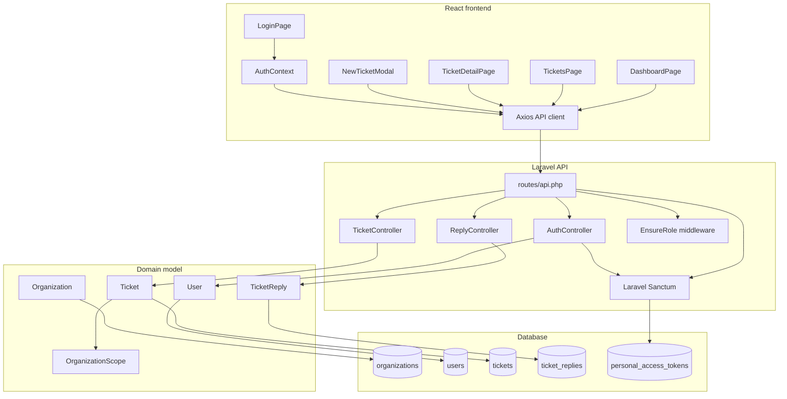
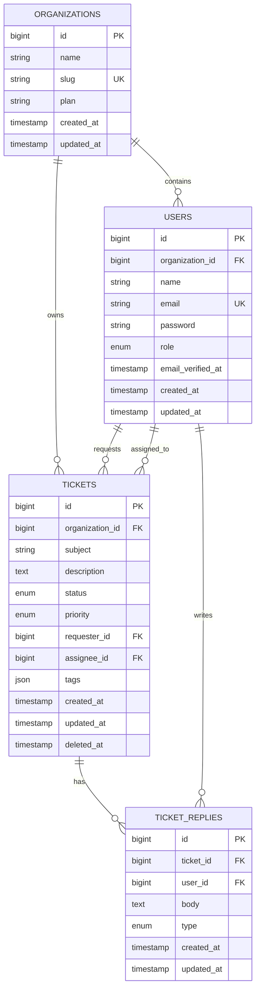
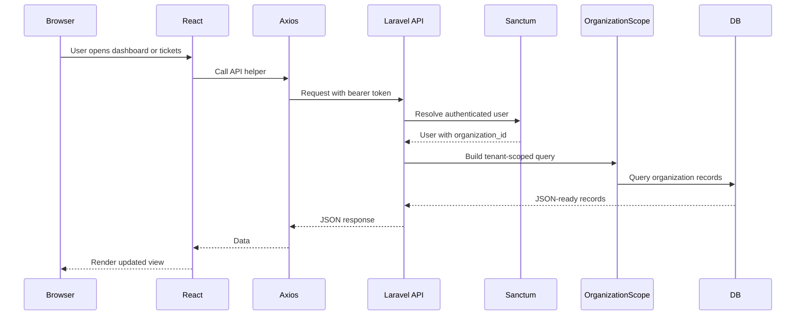

# PulseDesk Architecture

This document explains the current PulseDesk implementation: data model, API boundaries, tenancy controls, auth/role behavior, frontend flow, tests, and known tradeoffs.

## System Overview



## Data Model



## Tenancy Model

Tenant ownership is based on `organization_id`.

- `users.organization_id` links each authenticated user to one tenant.
- `tickets.organization_id` owns ticket records.
- `Ticket` registers `OrganizationScope`, which automatically filters ticket queries to `auth()->user()->organization_id`.
- Cross-tenant ticket access returns `404` because route model binding cannot resolve scoped tickets outside the authenticated organization.
- Tests in `backend/tests/Feature/MultiTenancyTest.php` cover list scoping and cross-tenant ticket access.

The current implementation scopes tickets directly. Replies are reached through a scoped ticket route, so reply access inherits ticket visibility.

## Auth And Roles

Laravel Sanctum issues personal access tokens from the auth endpoints. The frontend stores the token and user object in `localStorage`, then sends `Authorization: Bearer <token>` through the Axios interceptor in `frontend/src/api.js`.

Roles:

| Role | Capabilities |
| --- | --- |
| `admin` | Create, list, view, update, and delete tickets; view and create internal notes |
| `agent` | Create, list, view, update tickets; view and create internal notes |
| `customer` | Create, list, and view tickets; create public replies; cannot update/delete tickets; cannot see notes |

Role-restricted routes use `EnsureRole`:

- `PUT /api/tickets/{ticket}` allows `admin` and `agent`.
- `DELETE /api/tickets/{ticket}` allows `admin`.

Reply visibility:

- Agents/admins can create `reply` or `note`.
- Customers can only create public replies; attempts to submit a `note` are saved as `reply`.
- Customers listing replies only receive `type=reply`.

## API Routes

| Method | URI | Controller | Notes |
| --- | --- | --- | --- |
| `GET` | `/api/health` | Closure | Health check |
| `POST` | `/api/auth/register` | `AuthController@register` | Creates user and token |
| `POST` | `/api/auth/login` | `AuthController@login` | Returns user and token |
| `POST` | `/api/auth/logout` | `AuthController@logout` | Deletes current token |
| `GET` | `/api/auth/me` | `AuthController@me` | Loads organization |
| `GET` | `/api/tickets` | `TicketController@index` | Paginated, filtered, tenant-scoped |
| `POST` | `/api/tickets` | `TicketController@store` | Creates ticket for current user organization |
| `GET` | `/api/tickets/{ticket}` | `TicketController@show` | Loads requester, assignee, replies |
| `PUT` | `/api/tickets/{ticket}` | `TicketController@update` | Admin/agent only |
| `DELETE` | `/api/tickets/{ticket}` | `TicketController@destroy` | Admin only, soft delete |
| `GET` | `/api/tickets/{ticket}/replies` | `ReplyController@index` | Customer note filtering |
| `POST` | `/api/tickets/{ticket}/replies` | `ReplyController@store` | Reply/note creation |

Saved route evidence is in [backend/evidence/api-routes.txt](backend/evidence/api-routes.txt).

## Request Lifecycle



## Frontend Routes

| Route | Component | Purpose |
| --- | --- | --- |
| `/login` | `LoginPage` | Authenticates and stores token/user |
| `/dashboard` | `DashboardPage` | Shows ticket counts by status |
| `/tickets` | `TicketsPage` | Filterable/searchable ticket list |
| `/tickets/:id` | `TicketDetailPage` | Ticket detail, assignee control, replies, notes |
| `/` | `Navigate` | Redirects to `/dashboard` |

`PrivateRoute` protects the app pages by checking auth context.

## Tests

The backend suite currently covers:

- Auth register/login/logout/me flows.
- Ticket create/list/show/update/delete behavior.
- Role restrictions for customers vs agents/admins.
- Reply creation and customer note visibility.
- Organization-level ticket isolation.

Saved result:

```text
Tests: 24 passed (82 assertions)
Duration: 2.57s
```

## CI

The GitHub Actions workflow is at [.github/workflows/ci.yml](.github/workflows/ci.yml).

Jobs:

- Backend tests: install Composer dependencies, configure environment, migrate, seed, run Pest.
- Frontend build: install npm dependencies and run `npm run build`.
- Quality gate: waits for backend and frontend jobs.

## Key Decisions

- `OrganizationScope` centralizes ticket tenancy instead of repeating `where('organization_id', ...)` in every controller action.
- Tickets are soft-deleted so destructive admin actions are reversible at the data layer.
- Replies use a `type` enum rather than separate tables for public replies and internal notes.
- Frontend auth is simple bearer-token storage for demo speed and API clarity.
- SQLite is the default local setup for portability, while Laravel database config supports MySQL for event-style judging.

## Known Gaps And Tradeoffs

- No SLA timers, macros, notifications, activity log, or realtime updates are implemented.
- Agent config files under `agents/` are placeholders and should be filled with redacted real configs before final evidence submission.
- Sprint review files are present but currently empty.
- The app uses Laravel 13 although the original event target named Laravel 11. The architecture remains conventional Laravel REST API architecture.
