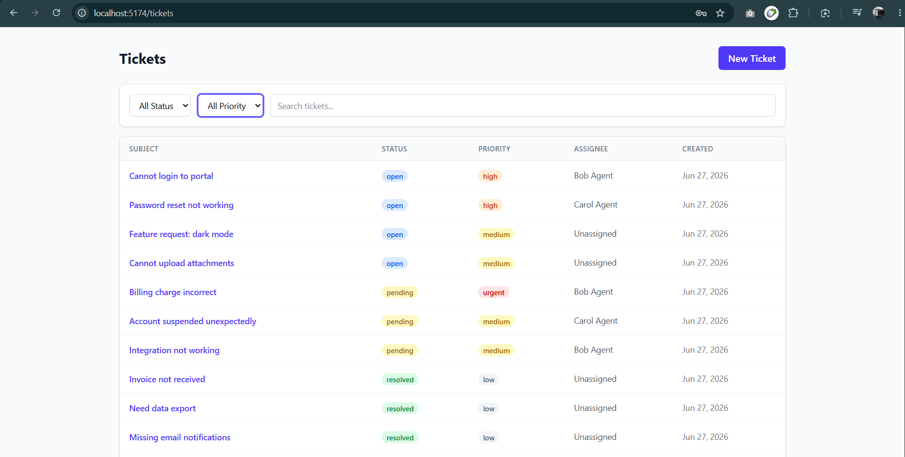
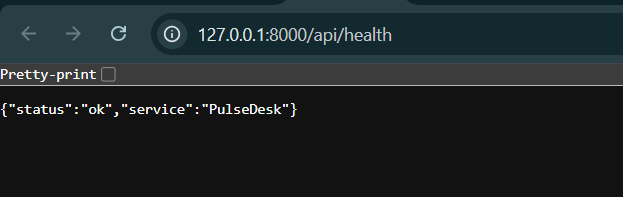
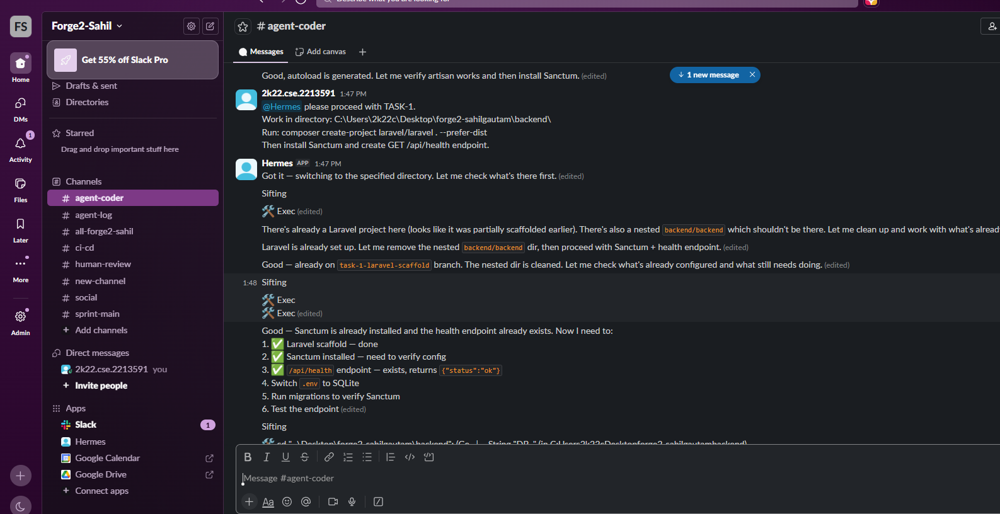
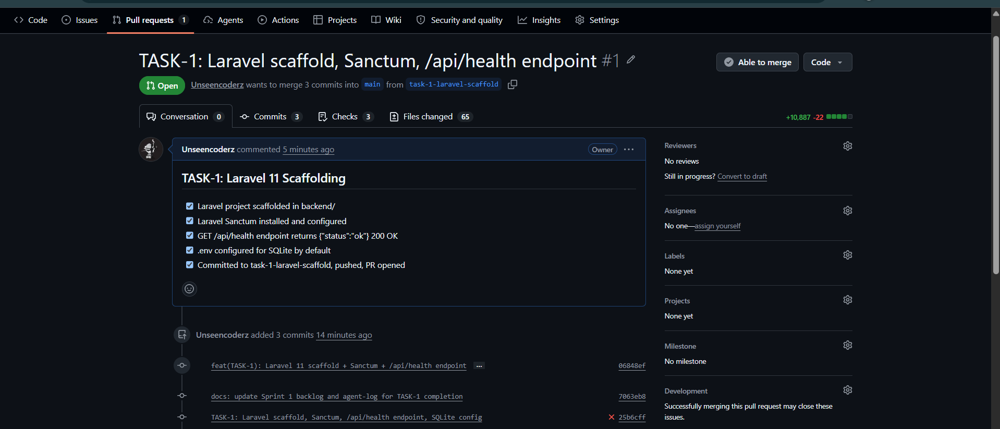
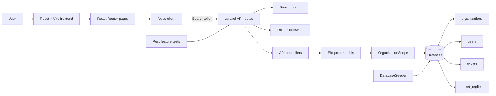

# PulseDesk

PulseDesk is a multi-tenant support desk SaaS. It gives an organization a shared ticket queue, role-based access, public customer replies, private internal notes, filters/search, seeded demo data, and a React interface backed by a Laravel JSON API.

This repository also includes the in-repo evidence needed to review the build: sprint notes, agent logs, Slack screenshots, API evidence, test output, CI workflow, and app screenshots. Private event instructions are not copied into this repo.

## Quick Links

- [Architecture](ARCHITECTURE.md)
- [Submission Checklist](SUBMISSION.md)
- [Agent Log](agent-log.md)
- [Backend Test Evidence](backend/evidence/pest-output.txt)
- [API Route Evidence](backend/evidence/api-routes.txt)
- [Ticket Detail Screenshot](slack-export/ticket-detailsPage.png)
- [Working API Screenshot](slack-export/working-api-endpoint.png)

## Screenshots

### Ticket Detail



### Working API Endpoint



### Agent Workflow Evidence



### Pull Request Evidence



## What Is Built

- Multi-tenant organizations with `organization_id` on tenant-owned records.
- Laravel Sanctum auth with `admin`, `agent`, and `customer` roles.
- Ticket CRUD with subject, description, status, priority, requester, assignee, tags, timestamps, and soft deletes.
- Ticket conversation with customer-visible public replies and agent/admin internal notes.
- Ticket list with status, priority, assignee, and text search filters.
- React dashboard, ticket list, ticket detail, login, and new-ticket flows.
- Seeder with one organization, one admin, two agents, two customers, 12 tickets, and sample replies/notes.
- Pest feature tests covering auth, ticket CRUD, reply visibility, roles, and tenant isolation.
- GitHub Actions workflow for backend tests and frontend build.

## Architecture At A Glance



More detail lives in [ARCHITECTURE.md](ARCHITECTURE.md).

## Tech Stack

| Layer | Current implementation |
| --- | --- |
| Backend | PHP 8.3+, Laravel 13, Laravel Sanctum |
| Frontend | React 19, Vite 8, React Router 7, Tailwind CSS 4, Axios |
| Database | SQLite for local portability; Laravel config also supports MySQL |
| Tests | Pest, PHPUnit, Laravel feature tests |
| CI | GitHub Actions with backend test and frontend build jobs |

## Local Setup: Portable SQLite

Use this path when you want the fastest local demo from a fresh clone.

```powershell
cd backend
composer install
Copy-Item .env.example .env
New-Item database/database.sqlite -ItemType File -Force
php artisan key:generate
php artisan migrate --seed
php artisan serve --host=127.0.0.1 --port=8000
```

Open a second terminal:

```powershell
cd frontend
npm install
Copy-Item .env.example .env
npm run dev
```

The frontend expects:

```text
VITE_API_URL=http://localhost:8000/api
```

## Local Setup: MySQL 8

Use this path when you want to run against the event-style database target.

1. Create a MySQL database named `pulsedesk`.
2. Create the backend environment file:

```powershell
cd backend
composer install
Copy-Item .env.example .env
```

3. Configure `backend/.env`:

```text
DB_CONNECTION=mysql
DB_HOST=127.0.0.1
DB_PORT=3306
DB_DATABASE=pulsedesk
DB_USERNAME=root
DB_PASSWORD=your_password
```

4. Run the backend setup:

```powershell
php artisan key:generate
php artisan migrate --seed
php artisan serve --host=127.0.0.1 --port=8000
```

5. Run the frontend setup from a second terminal:

```powershell
cd frontend
npm install
Copy-Item .env.example .env
npm run dev
```

## Demo Accounts

All seeded accounts use the password `password`.

| Role | Email |
| --- | --- |
| Admin | `admin@acme.com` |
| Agent | `agent1@acme.com` |
| Agent | `agent2@acme.com` |
| Customer | `cust1@acme.com` |
| Customer | `cust2@acme.com` |

## API Summary

| Method | Endpoint | Auth | Purpose |
| --- | --- | --- | --- |
| `GET` | `/api/health` | No | Service health check |
| `POST` | `/api/auth/register` | No | Register user and return token |
| `POST` | `/api/auth/login` | No | Log in and return token |
| `GET` | `/api/auth/me` | Yes | Return current user and organization |
| `POST` | `/api/auth/logout` | Yes | Revoke current token |
| `GET` | `/api/tickets` | Yes | Paginated ticket list with filters |
| `POST` | `/api/tickets` | Yes | Create ticket |
| `GET` | `/api/tickets/{ticket}` | Yes | Show ticket with requester, assignee, replies |
| `PUT` | `/api/tickets/{ticket}` | Admin/Agent | Update ticket |
| `DELETE` | `/api/tickets/{ticket}` | Admin | Soft-delete ticket |
| `GET` | `/api/tickets/{ticket}/replies` | Yes | List replies; customers do not see notes |
| `POST` | `/api/tickets/{ticket}/replies` | Yes | Add public reply or internal note |

Supported ticket filters:

```text
status=open|pending|resolved|closed
priority=low|medium|high|urgent
assignee_id=<user_id>
search=<text>
```

## Test And Build Commands

Backend:

```powershell
cd backend
php artisan test
```

Frontend:

```powershell
cd frontend
npm run build
```

Current saved backend evidence:

```text
Tests: 24 passed (82 assertions)
Duration: 2.57s
```

## Evidence Map

| Evidence | Path |
| --- | --- |
| Agent loop log | [agent-log.md](agent-log.md) |
| Sprint 1 backlog | [sprints/sprint-1/backlog.md](sprints/sprint-1/backlog.md) |
| Sprint 1 review | [sprints/sprint-1/review.md](sprints/sprint-1/review.md) |
| Sprint 2 backlog | [sprints/sprint-2/backlog.md](sprints/sprint-2/backlog.md) |
| Sprint 2 review | [sprints/sprint-2/review.md](sprints/sprint-2/review.md) |
| Slack sprint channel export note | [slack-export/sprint-main.md](slack-export/sprint-main.md) |
| Slack coder channel export note | [slack-export/agent-coder.md](slack-export/agent-coder.md) |
| Backend tests | [backend/evidence/pest-output.txt](backend/evidence/pest-output.txt) |
| API routes | [backend/evidence/api-routes.txt](backend/evidence/api-routes.txt) |
| Login/routes evidence | [backend/evidence/login-and-routes.txt](backend/evidence/login-and-routes.txt) |
| CI workflow | [.github/workflows/ci.yml](.github/workflows/ci.yml) |

## Image Links

- [Ticket details page screenshot](slack-export/ticket-detailsPage.png)
- [Working API endpoint screenshot](slack-export/working-api-endpoint.png)
- [Agent coder logs screenshot](slack-export/slack-agent-coder-logs.png)
- [Agent pull request screenshot](slack-export/slack-agentCoder-Pullrequest.png)
- [GitHub pull request screenshot](slack-export/github-pullreuest.png)
- [Hermes agent log screenshot](slack-export/hermes-agent-log.png)
- [Hermes task completed screenshot](slack-export/hermes-agent-taskCompleted.png)
- [Agent task 3 response screenshot](slack-export/agent-coder-task3-response.png)
- [Agent task 4 completed screenshot](slack-export/agent-coder-task4-completed.png)
- [Agent task 5 complete screenshot](slack-export/agent-coder-task5-Complete.png)
- [Agent task 6 completed screenshot](slack-export/agent-coder-task6-Completed.png)
- [Agent task 7 complete screenshot](slack-export/agent-coder-task7-Complete.png)
- [Agent task 9 completed screenshot](slack-export/agent-code-task9-Completed.png)
- [Agent task 11 complete screenshot](slack-export/agent-coder-task11-Complete.png)
- [Hero image asset](frontend/src/assets/hero.png)

## Known Review Notes

- The application currently runs on Laravel 13. The original target was Laravel 11, but the app uses standard Laravel routing, controllers, models, migrations, seeders, Sanctum auth, and Pest tests.
- `backend/.env.example` defaults to SQLite for portability. Use the MySQL setup above for a MySQL 8 run.
- `agents/hermes-config.md` and `agents/openclaw-config.md` exist but are currently empty placeholders. Add redacted real configs before final submission if agent configuration evidence is required.
- Sprint review files are present but currently empty. The backlog and Slack/evidence artifacts contain most of the current process trail.

## Repository Map

```text
backend/        Laravel API, models, migrations, seeders, tests, evidence
frontend/       React/Vite UI, routes, pages, components, API client
agents/         Agent configuration placeholders
sprints/        Sprint backlog and review files
slack-export/   Slack notes, screenshots, and workflow images
.github/        CI workflow
```
