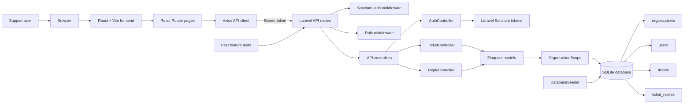
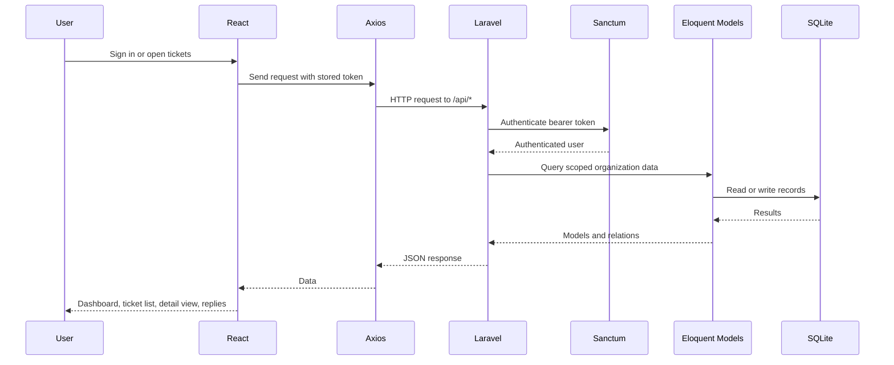
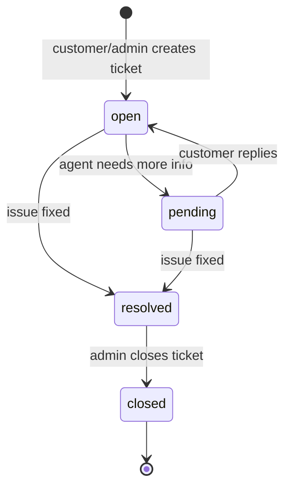

# PulseDesk - Support Ticket Platform

PulseDesk is a multi-tenant help desk app for managing support tickets, public replies, and private agent notes. The project is split into a Laravel API backend and a React/Vite frontend that talks to the API with bearer-token authentication.

## Contents

- [Screenshots](#screenshots)
- [Architecture](#architecture)
- [Tech Stack](#tech-stack)
- [Local Setup](#local-setup)
- [Demo Accounts](#demo-accounts)
- [API Summary](#api-summary)
- [Development Workflow](#development-workflow)
- [Tests and Evidence](#tests-and-evidence)
- [Image Links](#image-links)

## Screenshots

### Ticket Detail Page


### Working API Endpoint


### Agent Workflow Evidence


### Pull Request Evidence


## Architecture



### Request Flow



### Ticket Lifecycle



## Tech Stack

| Layer | Tools |
| --- | --- |
| Frontend | React 19, React Router 7, Vite 8, Tailwind CSS 4, Axios |
| Backend | PHP 8.3, Laravel 13, Laravel Sanctum |
| Database | SQLite by default |
| Testing | Pest, PHPUnit, Laravel feature tests |
| Evidence | Screenshots and route/test outputs in `slack-export/` and `backend/evidence/` |

## Local Setup

### 1. Backend API

Run these from the repository root:

```powershell
cd backend
composer install
Copy-Item .env.example .env
New-Item database/database.sqlite -ItemType File -Force
php artisan key:generate
php artisan migrate --seed
php artisan serve --host=127.0.0.1 --port=8000
```

The backend API will be available at:

```text
http://127.0.0.1:8000/api
```

Health check:

```text
GET http://127.0.0.1:8000/api/health
```

### 2. Frontend App

Open a second terminal from the repository root:

```powershell
cd frontend
npm install
Copy-Item .env.example .env
npm run dev
```

The frontend reads `VITE_API_URL` from `frontend/.env`. The example value is:

```text
VITE_API_URL=http://localhost:8000/api
```

## Demo Accounts

The seeder creates one Acme Corp organization with admin, agent, and customer users.

| Role | Email | Password |
| --- | --- | --- |
| Admin | `admin@acme.com` | `password` |
| Agent | `agent1@acme.com` | `password` |
| Agent | `agent2@acme.com` | `password` |
| Customer | `cust1@acme.com` | `password` |
| Customer | `cust2@acme.com` | `password` |

## API Summary

| Method | Endpoint | Auth | Purpose |
| --- | --- | --- | --- |
| `GET` | `/api/health` | No | Service health check |
| `POST` | `/api/auth/register` | No | Create user and return token |
| `POST` | `/api/auth/login` | No | Log in and return token |
| `GET` | `/api/auth/me` | Yes | Return current user with organization |
| `POST` | `/api/auth/logout` | Yes | Revoke current token |
| `GET` | `/api/tickets` | Yes | Paginated ticket list with filters |
| `POST` | `/api/tickets` | Yes | Create ticket |
| `GET` | `/api/tickets/{ticket}` | Yes | Show ticket with requester, assignee, replies |
| `PUT` | `/api/tickets/{ticket}` | Admin/Agent | Update status, priority, assignee, tags, or content |
| `DELETE` | `/api/tickets/{ticket}` | Admin | Delete ticket |
| `GET` | `/api/tickets/{ticket}/replies` | Yes | List replies; customers do not see internal notes |
| `POST` | `/api/tickets/{ticket}/replies` | Yes | Add public reply or internal note |

Ticket list filters supported by the API:

```text
status=open|pending|resolved|closed
priority=low|medium|high|urgent
assignee_id=<user_id>
search=<text>
```

## Development Workflow

1. Start the Laravel API with `php artisan serve --host=127.0.0.1 --port=8000`.
2. Start the React app with `npm run dev` from `frontend/`.
3. Log in with one of the seeded demo accounts.
4. Use `/dashboard` for ticket counts, `/tickets` for filtering/search, and `/tickets/:id` for status, assignee, replies, and internal notes.
5. Run backend tests before handoff:

```powershell
cd backend
php artisan test
```

6. Build the frontend before deployment:

```powershell
cd frontend
npm run build
```

## Tests and Evidence

The backend evidence currently shows:

```text
Tests: 24 passed (82 assertions)
Duration: 2.57s
```

Evidence files:

- [Pest output](backend/evidence/pest-output.txt)
- [API route list](backend/evidence/api-routes.txt)
- [Login and route evidence](backend/evidence/login-and-routes.txt)
- [Sprint 1 backlog](sprints/sprint-1/backlog.md)
- [Sprint 1 review](sprints/sprint-1/review.md)
- [Sprint 2 backlog](sprints/sprint-2/backlog.md)
- [Sprint 2 review](sprints/sprint-2/review.md)

## Image Links

Project and workflow images:

- [Ticket details page screenshot](slack-export/ticket-detailsPage.png)
- [Working API endpoint screenshot](slack-export/working-api-endpoint.png)
- [Agent coder logs screenshot](slack-export/slack-agent-coder-logs.png)
- [Agent pull request screenshot](slack-export/slack-agentCoder-Pullrequest.png)
- [GitHub pull request screenshot](slack-export/github-pullreuest.png)
- [Hermes agent log screenshot](slack-export/hermes-agent-log.png)
- [Hermes task completed screenshot](slack-export/hermes-agent-taskCompleted.png)
- [Agent task 3 response screenshot](slack-export/agent-coder-task3-response.png)
- [Agent task 4 completed screenshot](slack-export/agent-coder-task4-completed.png)
- [Agent task 5 complete screenshot](slack-export/agent-coder-task5-Complete.png)
- [Agent task 6 completed screenshot](slack-export/agent-coder-task6-Completed.png)
- [Agent task 7 complete screenshot](slack-export/agent-coder-task7-Complete.png)
- [Agent task 9 completed screenshot](slack-export/agent-code-task9-Completed.png)
- [Agent task 11 complete screenshot](slack-export/agent-coder-task11-Complete.png)

Frontend assets:

- [Hero image asset](frontend/src/assets/hero.png)
- [React asset](frontend/src/assets/react.svg)
- [Vite asset](frontend/src/assets/vite.svg)
- [App favicon](frontend/public/favicon.svg)
- [Icon sprite](frontend/public/icons.svg)

## Repository Map

```text
backend/        Laravel API, models, migrations, seeders, tests, evidence
frontend/       React/Vite UI, routes, pages, components, API client
slack-export/   Screenshots and exported workflow notes
sprints/        Sprint backlog and review notes
agents/         OpenClaw and Hermes agent configuration notes
```
